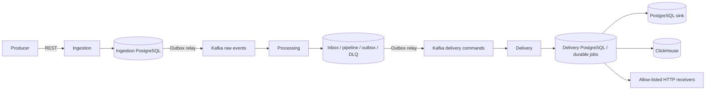

# EventFlow

**Reliable Event Processing Platform**

EventFlow accepts events over REST, validates and routes them through versioned
pipelines, and delivers them to PostgreSQL, ClickHouse or approved HTTP endpoints.
It demonstrates recovery across database, Kafka and remote-call crash windows in
three Java services.

This is a production-oriented architecture with a reproducible local demo. **JWT/RBAC
and tenant isolation are not implemented; do not expose the demo APIs publicly.**
See [the audit](docs/audit-2026.md) and [implementation report](docs/implementation-report.md)
for verified work and remaining release gates.

## Features

- Transactional outboxes, durable processing inbox and delivery jobs.
- Fenced leases, expired-job recovery, durable retry deadlines and guarded DLQ replay.
- Stable event identity, content conflicts and sink-specific idempotency.
- DRAFT → VALIDATED → ACTIVE pipelines, optimistic revisions, atomic rollback and
  side-effect-free dry-run with per-step results.
- Strict pipeline JSON Schema; immutable named event schemas; append-only pipeline history.
- HTTP destination allow-list, connection-time DNS/IP checks, no redirects, bounded
  requests and destination-scoped circuit breakers.
- Real PostgreSQL/Kafka/Redis/ClickHouse/WireMock tests and packaged application E2E.
- JSON logs, metrics, queue-age alerts, Grafana provisioning and OTLP infrastructure.

## Architecture



Each service owns its database. No service reads another service's tables.
Redis controls admission only; it is not the idempotency authority.

## Reliability Guarantees

Acceptance commits the event and its publication intent together. Kafka is
at-least-once; duplicates are normal. Processing completion and its output commit
atomically. Stale lease holders cannot complete, retry or dead-letter another
worker's attempt. Kafka failures without durable outcomes remain unacknowledged.

PostgreSQL sink uniqueness provides one business row per event/destination.
ClickHouse deduplication is eventual; use `FINAL` or latest-version aggregation.
HTTP effects depend on the receiver honoring `Idempotency-Key`. There is no global
exactly-once guarantee. See [crash semantics](docs/reliability.md).

## Technology Stack

Java 21, Spring Boot, Kafka, PostgreSQL/Flyway/JDBC, Redis, ClickHouse, Resilience4j,
Micrometer/Prometheus, OpenTelemetry/Jaeger, Grafana, Testcontainers, Maven.

## Quick Start

Prerequisites: Java 21, Maven 3.9.9+ (3.x), Docker Engine with Compose v2, Python 3
for the smoke test. Allocate sufficient Docker memory for the full demo and tests.

```bash
mvn clean verify
# Includes integration and packaged application E2E tests; Docker is mandatory.
docker compose up --build -d --wait
./scripts/smoke-test.sh
```

Compose publishes ports on loopback and contains disposable local credentials.
Service configuration requires explicit database passwords outside Compose.
`make down` preserves volumes. Never delete volumes to fix a migration failure.
For an existing pre-fencing installation, follow [upgrade notes](docs/runbooks/recovery.md).

## Send Your First Event

```bash
curl -i http://localhost:8080/api/v1/events \
  -H 'Content-Type: application/json' \
  -d @docs/examples/order-created.json
```

Reuse eventId and identical content to receive duplicate acceptance; changed content
with the same ID returns 409. `X-API-Key` currently names a rate-limit bucket only;
it does not authenticate the request. The smoke script creates a fresh ID and
verifies duplicate acceptance and delivery.

## Pipeline Example

```json
{
  "name": "orders", "version": 2, "eventType": "order.created",
  "steps": [
    {"type": "validate", "schema": "order-v1"},
    {"type": "route", "target": "POSTGRES", "destination": "operational_events"},
    {"type": "route", "target": "CLICKHOUSE", "destination": "events"}
  ]
}
```

Create with `POST /api/v1/pipelines`, validate with `POST /pipelines/{id}/validate?revision=0`,
then activate revision 1 with a reason. Full paths, dry-run and rollback semantics
are in [the control-plane guide](docs/control-plane.md).

## Failure Handling

Business retries are bounded; retry times survive restart. Restore dependencies
before replaying. `POST /api/v1/dlq/{id}/replay` on the owning processing/delivery API
reuses eventId. Content-conflict and malformed records cannot be replayed as valid
business events. See [the recovery runbook](docs/runbooks/recovery.md).

## Observability

| Endpoint | Local address |
|---|---|
| Ingestion / Processing / Delivery | localhost:8080 / :8081 / :8082 |
| Readiness | `/actuator/health/readiness` |
| Metrics | `/actuator/prometheus` |
| Grafana | localhost:3000 (`admin` / `admin`, local only) |
| Prometheus | localhost:9090 |
| Jaeger | localhost:16686 |
| Kafka UI | localhost:8088 |

Outbox pending/oldest-age gauges and alert rules support recovery diagnosis. OTLP
export configuration does not imply complete trace propagation across outbox
boundaries; see the implementation report for runtime evidence and limitations.

Event progress uses API composition, preserving service ownership:

```text
GET :8080/api/v1/events/{eventId}
GET :8081/api/v1/events/{eventId}
GET :8082/api/v1/events/{eventId}/deliveries
```

## Security

HTTP egress defaults to deny. Configure `eventflow.http.allowed-destinations` with
exact HTTPS URLs; private/local/metadata addresses are still denied at connection
time. Redirects and remote schema references are disabled. No secrets belong in
pipeline options or URLs. See [SECURITY.md](SECURITY.md) and [threat model](docs/security/threat-model.md).
Authentication, tenancy, webhook signatures and complete payload protection remain
release gates, not implied capabilities.

## Testing

```bash
make test       # Unit tests only
make verify     # Strict complete verification, including Docker-backed IT/E2E
make format     # Apply formatter
make smoke      # Existing local demo
```

Enforcer requires Java 21 and Maven 3.9.9+, dependency convergence, pinned compiler/
Surefire/Failsafe, Spotless, Checkstyle, JaCoCo (40% module line floor), and CycloneDX
SBOM. Coverage is a floor; concurrency and rollback behavior are asserted explicitly.
Reports are under each module's `target/`; aggregate inventory is `target/bom.json`.

## Performance

No throughput claim is made. [Methodology and load scripts](docs/performance.md)
separate offered load, accepted throughput and completed effects. Begin below the
configured admission limit and measure backlog drain as well as HTTP latency.

## Repository Structure

`common` holds wire contracts. `ingestion-service`, `processing-service` and
`delivery-service` are the only deployables. `infrastructure` contains local runtime
and telemetry configuration; `scripts` contains operational checks and load scenarios.

## Documentation

[Architecture](docs/architecture.md) · [Reliability](docs/reliability.md) ·
[Control plane](docs/control-plane.md) · [ADRs](docs/decisions/README.md) ·
[Contributing](CONTRIBUTING.md) · [Audit](docs/audit-2026.md) ·
[OpenAPI contracts](docs/openapi/)

## Roadmap

See [the evidence-based roadmap](docs/roadmap.md). Authentication/tenancy and schema
compatibility are the next release gates; retention and authenticated bulk DLQ
operations need explicit policies before implementation.

## Trade-offs

Polling outboxes and sequential workers favor understandable recovery. Leases fence
local state, not remote side effects. HTTP response handling sacrifices connection
reuse for bounded consumption. ClickHouse analytics is eventually consistent.
A single local Kafka broker and development credentials are not a production topology.
