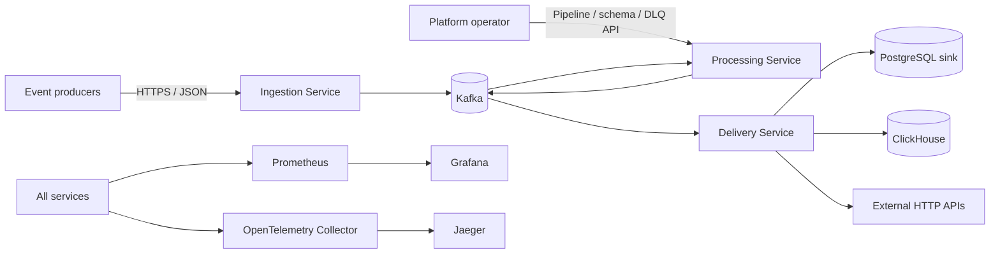
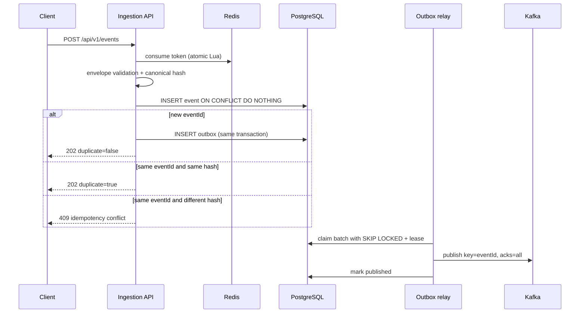
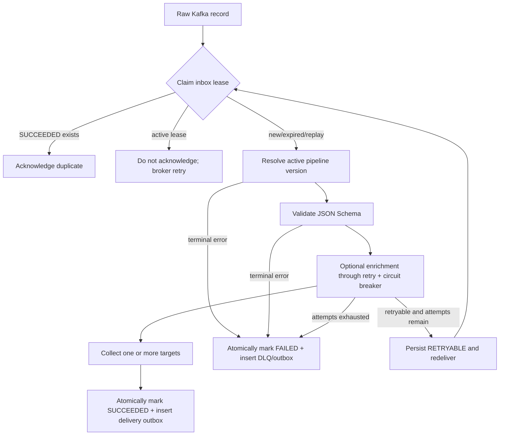
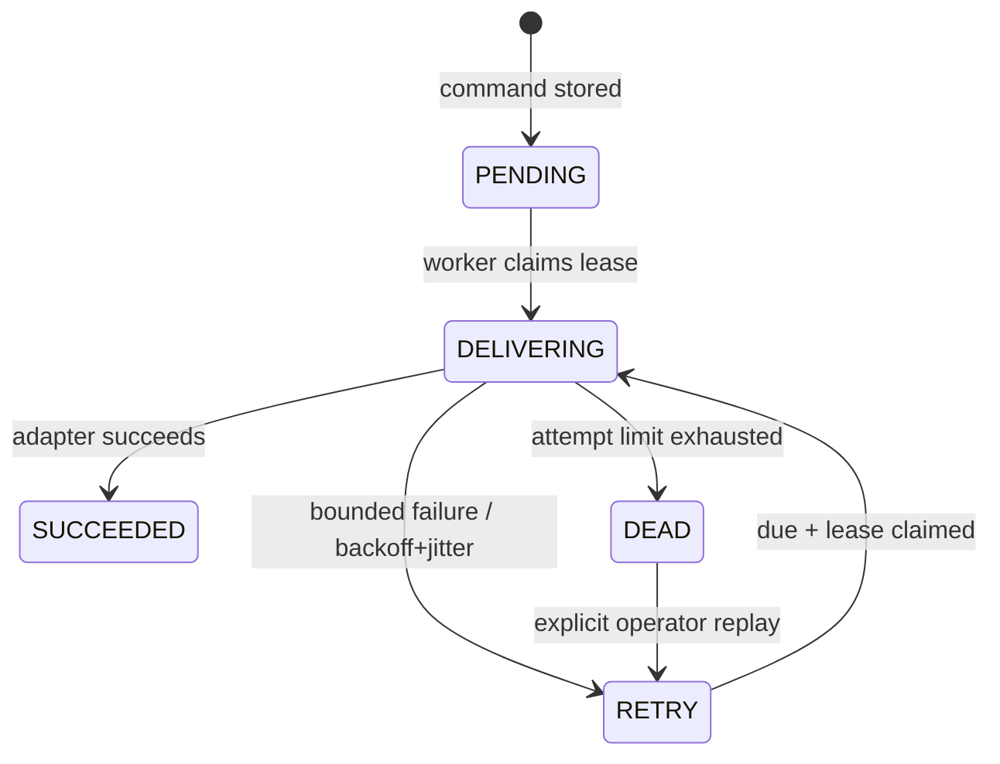

# EventFlow architecture

## 1. Purpose and quality attributes

EventFlow accepts heterogeneous business events, validates and transforms them with a versioned pipeline, and delivers them to one or more sinks. The design optimizes for:

1. no silent event loss;
2. deterministic recovery after process or dependency failure;
3. horizontal scaling without cross-instance coordination in application memory;
4. explicit contracts and backward-compatible evolution;
5. operational diagnosis from metrics, traces, logs, and durable audit data;
6. a small number of services with clear ownership.

The design does **not** promise global exactly-once delivery. Such a promise cannot be fulfilled for arbitrary HTTP endpoints. It provides at-least-once transport and effectively-once state transitions where a durable idempotency key or upsert is available.

## 2. System context



## 3. Deployable units and ownership

| Unit | Responsibility | Owns | Must not do |
|---|---|---|---|
| Ingestion | Authenticate/limit producers, validate envelope, bind `eventId`, enqueue raw event | accepted events, ingestion outbox | execute business pipelines or call sinks |
| Processing | Resolve pipeline, validate schema, enrich, route, create delivery command, processing DLQ | schemas, pipeline versions, processing inbox, processing outbox, processing DLQ | write delivery state or sink tables |
| Delivery | Materialize commands as durable jobs, retry adapters, isolate sink failures, delivery DLQ | delivery inbox/jobs/audit, operational sink table | re-run business transformations |
| Common | Wire records and topic names | versioned message contract source | contain persistence entities or business services |

Each service has a separate PostgreSQL database. A single PostgreSQL container is used locally only to reduce resource consumption. Cross-database joins are forbidden.

## 4. Event flow

### 4.1 Ingestion



Redis limits traffic but is not the idempotency source of truth. PostgreSQL's unique constraint is the final arbiter. A crash after Kafka accepts a message but before `published_at` is stored produces a duplicate by design.

### 4.2 Processing

Pipeline steps execute sequentially inside one processing attempt. Steps are not independent Kafka consumers because the order is part of the pipeline semantics.



The selected pipeline name and version are stored with the processing record. A configuration update affects only attempts that start after activation. Production evolution should use immutable definitions: create version `N+1`, validate it, then activate it atomically.

### 4.3 Delivery

The delivery consumer only materializes jobs. It never performs network I/O before the Kafka offset can safely be acknowledged.



Adapter idempotency strategy:

| Sink | Strategy |
|---|---|
| PostgreSQL | `ON CONFLICT (event_id, destination) DO UPDATE` |
| ClickHouse | `ReplacingMergeTree(version)`; queries requiring strict dedup use `FINAL` or aggregate by latest version |
| External HTTP | stable `Idempotency-Key: eventId`; endpoint must honor it for effectively-once behavior |

## 5. Kafka topology

| Topic | Key | Producer | Consumer group | Local partitions | Suggested retention |
|---|---|---|---|---:|---|
| `eventflow.events.raw.v1` | `eventId` | ingestion/processing replay | `eventflow-processing-v1` | 6 | 7 days |
| `eventflow.events.delivery.v1` | `eventId` | processing | `eventflow-delivery-v1` | 6 | 7 days |
| `eventflow.events.processing-dlq.v1` | `eventId` | processing | audit/alerting | 6 | 30 days |
| `eventflow.events.delivery-dlq.v1` | `eventId` | delivery | audit/alerting | 6 | 30 days |

Production uses replication factor 3 and `min.insync.replicas=2`; local Compose necessarily uses one broker. Partition count is capacity planning, not a value to change casually: it changes key-to-partition mapping and therefore ordering during the transition.

## 6. Contract rules

- Envelope fields are stable and `contractVersion` is explicit.
- Additive optional fields are backward-compatible. Removing, renaming, or changing meaning requires a new contract/topic version.
- `eventId` identifies the business occurrence and never changes during replay.
- `commandId` identifies one processing output and deduplicates delivery fan-out.
- Timestamps are UTC ISO-8601 instants.
- Arbitrary payload remains a JSON tree; routing metadata is separated from domain payload.
- Kafka headers should carry W3C `traceparent`; the field in the current contract is a portable fallback.

## 7. Pipeline model

```json
{
  "name": "orders",
  "version": 2,
  "eventType": "order.created",
  "steps": [
    {"type": "validate", "schema": "order-v1"},
    {"type": "enrich", "source": "customer-service"},
    {"type": "route", "target": "POSTGRES", "destination": "operational_events"},
    {"type": "route", "target": "CLICKHOUSE", "destination": "events"}
  ]
}
```

The engine uses a fixed allow-list of Java step implementations. Configuration selects and parameterizes code; it cannot load arbitrary classes or scripts. Pipeline definitions now use strict JSON Schema, optimistic revisions, atomic activation/rollback, local append-only history and a side-effect-free dry-run. RBAC, authenticated tenant scope and authenticated audit identity remain release gates. See [the control-plane guide](control-plane.md).

## 8. Scaling model

- Ingestion instances scale behind an L7 load balancer. Outbox relays coordinate through row locks and leases.
- Processing and delivery scale up to the useful partition count per consumer group. Extra consumers remain idle.
- Delivery workers also coordinate through PostgreSQL leases, allowing more worker threads than Kafka partitions after commands have been materialized.
- Slow external sinks do not block processing. They accumulate isolated delivery jobs and expose lag/age metrics.
- PostgreSQL tables with sustained volume require time-based retention/archival. Outbox rows are purged only after a safety window.

Initial production targets should be measured, not guessed. A reasonable test baseline is 1,000 accepted events/s, p95 ingestion under 150 ms, and recovery without loss after killing any service between each pair of durable writes.

## 9. Security boundaries

The current code is a local-development foundation. Pipeline definitions already use an explicit draft/activate transition and schemas are immutable by name. Production readiness additionally requires:

- OAuth2/JWT or mTLS for ingestion; separate operator authentication for admin APIs;
- tenant identity derived from credentials, never trusted from payload;
- per-tenant limits and quotas;
- TLS/SASL for Kafka, TLS for databases and all HTTP traffic;
- secrets from a secret manager, not Compose environment defaults;
- authenticated destination management (delivery already enforces an exact HTTPS allow-list and connection-time DNS/IP policy);
- payload size/depth limits and sensitive-field redaction;
- immutable audit records for pipeline/schema changes and DLQ replay.

These are release gates, not optional enhancements.

## 10. Observability and SLOs

Every service exposes readiness/liveness and Prometheus metrics and sends traces through OTLP. Production alerts should be based on user impact and queue age:

| Signal | Alert example |
|---|---|
| Ingestion availability | successful responses below 99.9% over 10 minutes |
| Oldest unpublished outbox row | above 60 seconds |
| Kafka consumer lag | growing for 10 minutes or oldest record above SLO |
| Processing DLQ | any sustained non-test rate |
| Delivery retry age | p95 above target-specific SLO |
| Circuit breaker | open longer than one cool-down window |
| PostgreSQL/Redis/Kafka | saturation, connection errors, disk headroom |

Trace/log correlation uses `eventId`, `commandId`, pipeline version, Kafka topic/partition/offset, delivery job ID, and W3C trace ID. Payloads must not be logged by default.
