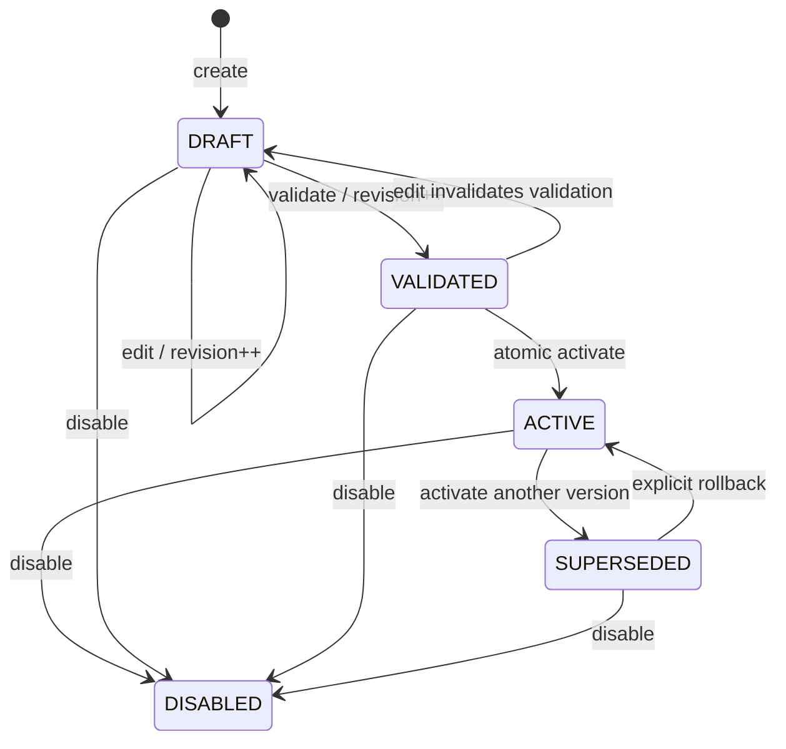

# Pipeline control plane

All paths are on processing-service. The current demo is local-only and unauthenticated.
`version` identifies immutable business behavior after activation; `revision` guards
operator changes. Read the returned summary after each operation.

| Method / path | Input | Result |
|---|---|---|
| POST `/api/v1/pipelines` | Definition JSON | 201, Location, DRAFT revision 0 |
| GET `/api/v1/pipelines/{id}` | — | Summary: state, revision, business version |
| PUT `/api/v1/pipelines/{id}?revision=N` | Definition with same name/version/eventType | Edited DRAFT, revision N+1 |
| POST `/api/v1/pipelines/{id}/validate?revision=N` | — | VALIDATED, revision N+1 |
| POST `/api/v1/pipelines/{id}/dry-run` | Test payload JSON | Steps, intermediate results, routes, warnings, errors, durationNanos |
| POST `/api/v1/pipelines/{id}/activate?revision=N` | `{"reason":"Reviewed routes"}` | ACTIVE; previous active becomes SUPERSEDED |
| POST `/api/v1/pipelines/{id}/rollback?revision=N` | `{"reason":"Receiver incompatible"}` | Select this SUPERSEDED version as ACTIVE |
| POST `/api/v1/pipelines/{id}/disable?revision=N` | Reason JSON | DISABLED |
| PUT `/api/v1/schemas/{name}` | JSON Schema 2020-12 | Immutable named schema; identical republish is allowed |

Definition shape is in `processing-service/src/main/resources/schemas/pipeline.json`.
Only validate/enrich/route implementations are allowed. No scripts, class names or
shell commands are executable configuration. Schema references must resolve inside
the same document. Dry-run with enrichment deliberately reports an incomplete preview.

A missing pipeline returns 404; stale revision or forbidden state transition returns
409; malformed definitions return 400. Pipeline identity fields cannot change while
editing. Reasons are mandatory for activation, rollback and disabling.

Schema families/compatibility, authenticated audit identity, tenancy and destination
registry discovery remain separate release gates. HTTP delivery itself enforces its
configured URL allow-list even if a draft references an unapproved destination.
